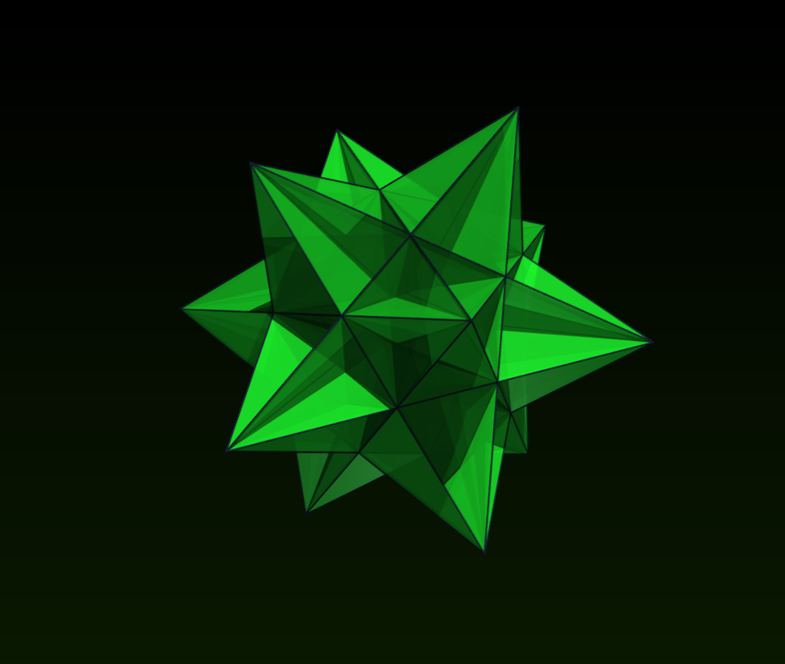

# Data Structures, Algorithms and Geometry

This repository contains simple C++ implementations of common data structures, algorithms, and geometry components. It is used for studying how they work and how to implement them.

## Implemented data structures

- [Array](include/data_structures/array.h)
- [Vector](include/data_structures/vector.h)
- [Singly linked list](include/data_structures/singly_linked_list.h)
- [Doubly linked list](include/data_structures/doubly_linked_list.h)
- [Queue](include/data_structures/queue.h)
- [Stack](include/data_structures/stack.h)

The shared [list node](include/data_structures/ListNode.h) implementation is now used by the linked lists and the queue.

## Geometry module

The `dsa::geometry` namespace contains 2D and 3D geometry primitives and algorithms. The collection is gradually expanding.

### Primitives

- [Vectors](include/geometry/primitives/vectors.h): `vector2d` and `vector3d`, with arithmetic, dot and cross products, norms, and normalization
- [Points](include/geometry/primitives/points.h): `Point2` and `Point3`, with vector translation and distance calculations
- [Segments](include/geometry/primitives/segments.h): `Segment2` and `Segment3`, with direction, length, and interpolation through `pointAt(t)`
- [Triangles](include/geometry/primitives/triangles.h): `Triangle2` and `Triangle3`, with area, edges, degeneracy checks, and 3D normals
- [Triangle meshes](include/geometry/primitives/triangle_mesh.h): `TriangleMesh`, vertex/triangle counts, index and geometric validation, per-triangle area and normals, and triangle-orientation reversal

### Mesh topology

- [Triangle topology](include/geometry/topology/triangle_topology.h): edges, triangle adjacency, incident triangles, boundary and non-manifold edge detection

### Algorithms

- [2D segments](include/geometry/algorithms/segment2.h): point-on-segment test, closest point, squared distance, and segment intersection
- [3D segments](include/geometry/algorithms/segment3.h): point-on-segment test, closest point, squared distance, and intersection of coplanar or collinear segments; skew segments do not intersect
- [2D triangles](include/geometry/algorithms/triangle2.h): barycentric coordinates and point-in-triangle test
- [3D triangles](include/geometry/algorithms/triangle3.h): barycentric coordinates, point-in-triangle test, closest point on the triangle, and closest point on its boundary edges

### Mesh I/O

- [VTK export](include/geometry/io/vtk.h): writes a triangle mesh as an ASCII legacy VTK `POLYDATA` file for viewing in ParaView

## Build

The project builds a C++17 library named `dsa-studying`:

```sh
cmake -S . -B build
cmake --build build
```

## Usage

### Triangle operations

Include headers from `include/` and use the `dsa::geometry` namespace:

```cpp
#include "geometry/algorithms/triangle3.h"

using namespace dsa::geometry;

Triangle3 triangle{
    Point3{0.0, 0.0, 0.0},
    Point3{1.0, 0.0, 0.0},
    Point3{0.0, 1.0, 0.0},
};

double area = triangle.area();
vector3d normal = triangle.normal();
Point3 closest = closestPointOnTriangle(Point3{0.8, 0.8, 1.0}, triangle);
```

### Triangle mesh topology

Build topology for a mesh of two adjacent triangles:

```cpp
#include "geometry/primitives/triangle_mesh.h"
#include "geometry/topology/triangle_topology.h"

using namespace dsa::geometry;

TriangleMesh mesh{
    {
        Point3{0.0, 0.0, 0.0},
        Point3{1.0, 0.0, 0.0},
        Point3{1.0, 1.0, 0.0},
        Point3{0.0, 1.0, 0.0},
    },
    {
        TriangleIndices{0, 1, 2},
        TriangleIndices{0, 2, 3},
    },
};

TriangleTopology topology = buildTriangleTopology(mesh);
bool manifold = topology.isManifold();
std::size_t edgeCount = topology.edgeCount();
```

### Kepler–Poinsot polyhedron: great icosahedron

The great icosahedron is a non-convex regular Kepler–Poinsot polyhedron. Its mesh has 12 vertices, 30 edges, and 20 triangular faces; five faces meet at every vertex.

The [great icosahedron demo](examples/geometry/great_icosahedron_vtk_demo.cpp) builds this closed manifold mesh, validates its topology, and exports it to VTK.



After building the project, generate the VTK file with:

```sh
cmake --build build --target generate_great_icosahedron_vtk
```

This creates `build/great_icosahedron.vtk`, which can be opened, for example, in *ParaView*.